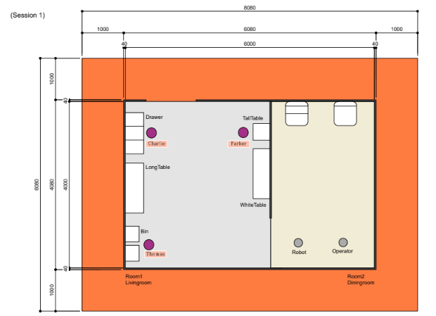

[日本語](./fmm_ja.md) | [English](./fmm_en.md)

# Find My Mates(FMM)

## Main Goal
The robot need to find three guests in living room and provide to the operator the guests' name and two characteristics (e.g. age, sex, color of clothes) from each guests. 

 

## Focus
This task focus on Human-Robot Interaction, Person Detection, Person Recognition, Feature Detection. It also focuses on the integration of these systems.

 

## Setup
- Location：the arena will look like a home environment．This task is conducted inside the arena.
- Start Position： the robot start position will be in the specified location of the dining room.
    - The robot does not need to face to operator when starting task.
- Time：Setup (5 min)，Competition Time (7 min)
- Guest：each team should prepare two or more people. If the team prepares two people, the organization committee will prepare one more person from their criteria. 

 

## Arena
The arena to be used in this task will be as follows.
※ There is no door in the entrance.  
※ The guest location is random and nearby to a furniture in living room.（this image represents is an example of the possible position of the guests）

 

## Scenario
You might need to repeat this task upto 3 times.
- Move and detect a guest.
    - It is necessary to show evidence that the guest was detected (e.g. Bounding Box).
- Move infront of the guest.
    - Only admited if the distance between the robot and the person is within 1.5 meters.
- Move back to the front of the operator.
- Provide the guest location to the operator.
    - It is necessary to report the nearest furniture of the guest.
- Provide the guest name to the operator.
    - The name will be one of the provided list [List of names](./Names.pdf)
- Provide the correct guest’s description 1 to the operator.
- Provide the correct guest’s description 2 to the operator.

※ The robot must go back to operator for each report. The recognition of all guests at once is not allowed.  
※ Accepted characteristics will be those obtained only through image recognition.  
※ The organized commitee will prepare in advance one person as a guest.

 

## Local Rules
Eventhough most of the rules are based on the RoboCup World competition Rulebook, there will be some local rules applied for the RCJ2023.
1. Competition time is 7 minutes.
2. Distance between the robot and the person should be within 1.5 meteer.
3. The accepted characteristics will be those obtained only through image recognition.
4. It is nessesary to show evidence when robot detects a human(e.g. Bounding Box).
5. The robot must go back to operator for each report. The recognition of all guests at once is not allowed.  
6. If all guests does not have same characteristics, it is allowed to report those characteristics to the operator.
7. The robot is allowed that report same characteristics only once per one trial.

 

## About characteristic (attributes)
The characteristics to be count will be those only chosen during the TLM.
The selected characteristics are the following.
You can use any of the characteristics listed below.
The organization comittee will confirm characteristics that each team will be using during the last TLM the day before the task.
- Age
- Sex
- Glass (with/without)
- Hair color
- Color of clothes（tops belongs to one attribute. Bottoms belongs to other attributes）
- Pattern of clothes
- Type of clothes
- Height
- Length of hair（long/short）
- Hat (with/without)
- Mask (with/without)

 

## Deus Ex Machina
In this task, you are allowed to use Deus Ex Machina.
On one hand using Deus Ex Machina deducts points from your original score. On the other hand, the robot can skip easily that part and continue with the task.

<table>
  <tr>
    <th> <b>Action<b> </th>
    <th> <b>Bypassing<b> </th>
  </tr>
  <tr>
    <td> Detect a guest </td>
    <td>
      <ul>
        <li> Person has to wave to the robot in order to be found. </li>
      </ul> 
    </td>
  </tr>
  <tr>
    <td> Detect a guest </td>
    <td>
      <ul>
        <li> Person has to approach the robot. </li>
      </ul> 
    </td>
  </tr>
   <tr>
    <td> Detect the guest location </td>
    <td>
      <ul>
        <li> Person has to tell the robot where he/she is standing. </li>
      </ul> 
    </td>
  </tr>
</table>

 
   
## Score Sheet
The highest score between the two trials will be choosen as final result.
<table>
  <tr>
    <th> <b>Action</b> </th>
    <th> <b>Score</b> </th>
  </tr>
  <tr>
    <td colspan="2" align="center"> <b>Main Goal</b> </td>
  </tr>
  <tr>
    <td> Detect a guest </td>
    <td align="center"> 40×2 </td>
  </tr>
  <tr>
    <td> Move to the front of the guest </td>
    <td align="center"> 10×2 </td>
  </tr>
  <tr>
    <td> Go back to the front of the operator </td>
    <td align="center"> 10×2 </td>
  </tr>
  <tr>
    <td> Provide the guest location </td>
    <td align="center"> 40×2 </td>
  </tr>
    <tr>
    <td> Provide the correct 1st/2nd guest’s name </td>
    <td align="center"> 50×2 </td>
  </tr>
  <tr>
    <td> Provide the correct 1st/2nd guest’s description 1 </td>
    <td align="center"> 50×2 </td>
  </tr>
  <tr>
    <td> Provide the correct 1st/2nd guest’s description 2 </td>
    <td align="center"> 50×2 </td>
  </tr>
    <tr>
    <td colspan="2" align="center"> <b>Bonus rewards</b> </td>
  </tr>
  <tr>
    <td> Detect the 3rd guest </td>
    <td align="center"> 50 </td>
  </tr>
  <tr>
    <td> Move to the front of the 3rd guest </td>
    <td align="center"> 25 </td>
  </tr>
  <tr>
    <td> Go back to the front of the operator </td>
    <td align="center"> 25 </td>
  </tr>
  <tr>
    <td> Provide the 3rd guest location </td>
    <td align="center"> 50 </td>
  </tr>
    <tr>
    <td> Provide the correct 3rd guest’s name </td>
    <td align="center"> 50 </td>
  </tr>
  <tr>
    <td> Provide the correct 3rd guest’s description 1 </td>
    <td align="center"> 100 </td>
  </tr>
  <tr>
    <td> Provide the correct 3rd guest’s description 2 </td>
    <td align="center"> 100 </td>
  </tr>
  <tr>
    <td colspan="2" align="center"> <b>Deus Ex Machina</b> </td>
  </tr>

<tr>
    <td> Person has to wave to the robot in order to be found  </td>
    <td align="center"> -75 </td>
  </tr>
  <tr>
    <td> Person has to approach the robot </td>
    <td align="center"> -75 </td>
  </tr>
  <tr>
    <td> Person has to tell the robot where he/she is standing </td>
    <td align="center"> -150 </td>
  </tr>
    <tr>
    <td colspan="2" align="center"> <b>Penalties</b> </td>
  </tr>
  <tr>
    <td> Not attending (without permission) </td>
    <td align="center"> -500 </td>
  </tr>
  <tr>
    <td> <b>Total Score (including bonus points)</b> </td>
    <td align="center"> <b>900</b> </td>
  </tr>
</table>

 

## Instructions by organization comittee
- During the TLM previous to the task (one day before).
  - The organization comittee will confirm the charactristics to be used during the task.
- A few minutes before the begining of the task.
  - All guests are given a name and a position by organization comittee.
  - Confirm if the team will be using Deus Ex Machina.

 

## Preparation by each team
- About guests
  - Each team should prepare two or more people in advance.  
  If the team prepares only two people, the organization commitee will prepare one more person. 
- About the referee
  - Each team needs to choose a referee. A detail explanation will be given the day before in the TLM.