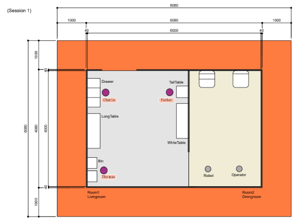

[日本語](./fmm_ja.md) | [English](./fmm_en.md)

# Find My Mates(FMM)

## メインゴール
リビングにいる3名のゲストを見つけて、名前とその人の特徴（年齢、性別、服の色など）をオペレーターに伝える。

 

## フォーカス
このタスクでは，人とロボットとのインタラクション、人検出、人認識、見た目の特徴認識、またこれらのシステム統合に焦点を当てています．

 

## セットアップ
- ロケーション：家庭環境を模したアリーナ環境が用いられます．競技はアリーナの中で行われます．
- スタート位置： ロボットは，ダイニングルームの指定された位置からスタートします．
    - オペレータの方向を向いてスタートする必要はありません
- 時間：セットアップ5分，競技時間7分
- ゲスト：各チーム2人以上を連れてくる．運営が1人準備します．

 

## アリーナ
今回使用する環境は以下の通りです．  
※入口にドアはありません  
※ゲストの位置はランダムに入れ替わります（下図のゲストの位置は一例です）

 

## シナリオ
以下の流れを3人分繰り返す（3人目はボーナス）
- 移動してゲストを見つける
    - 顔のBoundingBoxなど証拠の提示が必要
- ゲストの位置へ移動
    - 人とロボットの距離が1.5m以内でゲストの位置に移動できたことが認められる
- オペレータの位置に戻る
- ゲストの位置を提供
    - ゲストが立っていた位置で一番近い家具を報告する
- ゲストの名前を提供
    - 使用する名前は[こちら](./Names.pdf)
- ゲストの特徴１を提供
- ゲストの特徴２を提供

※一人ずつ実施する（毎回オペレータの位置に戻る．複数人の認識をまとめて実施するのは不可）  
※特徴の取得は、画像認識のみ（音声は不可）  
※大会側（OC）でゲストを１名用意する

 

## ローカルルール
基本的にルールは世界大会に準拠していますが，RCJ2023のみで適用するローカルルールがあります．
1. 競技時間は7分
2. 人との距離は1.5m以内
3. 特徴の取得は画像認識のみ（音声は不可）
4. 人の検出は顔のBounding Boxなどの証拠の提示が必要
5. 複数人の認識をまとめてするのは不可
6. 3人が同じ特徴でなければ認める（絞り込みができれば良い）
7. 競技内で1人1回のみ特徴を使うことが可能

 

## 使用する特徴について
TLMで議論し決定されたもののみになります．
今回決定した特徴は以下のとおりです．  
以下の項目の中の特徴であれば，どれを使用しても大丈夫です．  
各チームが使用する特徴の最終決定は前日のTLMで行います．
- 年齢
- 性別
- 眼鏡の有無
- 髪の色
- 服の色（上下は別項目）
- 服の柄
- 服装の種類
- 身長
- 髪の長さ（長いor短い）
- 帽子の有無
- マスクの有無

 

## デウスエクスマキナ
本競技では，次のデウスエクスマキナが採用されます．  
デウスエクスマキナでは減点されますが，より簡単な手法でアクションをスキップし，  
タスクを継続することができます．

<table>
  <tr>
    <th> <b>Action<b> </th>
    <th> <b>Bypassing<b> </th>
  </tr>
  <tr>
    <td> ゲストの検出 </td>
    <td>
      <ul>
        <li> ゲストがロボットに見つけてもらうために手を振る </li>
      </ul> 
    </td>
  </tr>
  <tr>
    <td> ゲストの検出 </td>
    <td>
      <ul>
        <li> 人がロボットに近づく </li>
      </ul> 
    </td>
  </tr>
   <tr>
    <td> ゲストの位置取得 </td>
    <td>
      <ul>
        <li> ゲストがどこにいるかをロボットに教える </li>
      </ul> 
    </td>
  </tr>
</table>

 
   
## スコアシート
このタスクでは，2回のトライアルの内，最高得点のみがスコアとして記録されます．
<table>
  <tr>
    <th> <b>Action</b> </th>
    <th> <b>Score</b> </th>
  </tr>
  <tr>
    <td colspan="2" align="center"> <b>メインゴール(2人分)</b> </td>
  </tr>
  <tr>
    <td> ゲストの検出 </td>
    <td align="center"> 40×2 </td>
  </tr>
  <tr>
    <td> ゲストの前に移動する </td>
    <td align="center"> 10×2 </td>
  </tr>
  <tr>
    <td> オペレータの前に戻ってくる </td>
    <td align="center"> 10×2 </td>
  </tr>
  <tr>
    <td> 正確なゲストの位置を報告する </td>
    <td align="center"> 40×2 </td>
  </tr>
    <tr>
    <td> 正確なゲストの名前を報告する </td>
    <td align="center"> 50×2 </td>
  </tr>
  <tr>
    <td> 正確なゲストの特徴（1つ目）を報告する </td>
    <td align="center"> 50×2 </td>
  </tr>
  <tr>
    <td> 正確なゲストの特徴（2つ目）を報告する </td>
    <td align="center"> 50×2 </td>
  </tr>
    <tr>
    <td colspan="2" align="center"> <b>ボーナス（3人目）</b> </td>
  </tr>
  <tr>
    <td> ゲストの検出 </td>
    <td align="center"> 50 </td>
  </tr>
  <tr>
    <td> ゲストの前に移動する </td>
    <td align="center"> 25 </td>
  </tr>
  <tr>
    <td> オペレータの前に戻ってくる </td>
    <td align="center"> 25 </td>
  </tr>
  <tr>
    <td> 正確なゲストの位置を報告する </td>
    <td align="center"> 50 </td>
  </tr>
    <tr>
    <td> 正確なゲストの名前を報告する </td>
    <td align="center"> 50 </td>
  </tr>
  <tr>
    <td> 正確なゲストの特徴（1つ目）を報告する </td>
    <td align="center"> 100 </td>
  </tr>
  <tr>
    <td> 正確なゲストの特徴（2つ目）を報告する </td>
    <td align="center"> 100 </td>
  </tr>
  <tr>
    <td colspan="2" align="center"> <b>デウスエクスマキナ</b> </td>
  </tr>

<tr>
    <td> ゲストがロボットに見つけてもらうために手を振る </td>
    <td align="center"> -75 </td>
  </tr>
  <tr>
    <td> 人がロボットに近づく </td>
    <td align="center"> -75 </td>
  </tr>
  <tr>
    <td> ゲストがどこにいるかをロボットに教える </td>
    <td align="center"> -150 </td>
  </tr>
    <tr>
    <td colspan="2" align="center"> <b>ペナルティ</b> </td>
  </tr>
  <tr>
    <td> 不参加(無断) </td>
    <td align="center"> -500 </td>
  </tr>
  <tr>
    <td> <b>合計(ボーナスタスクを含む)</b> </td>
    <td align="center"> <b>900</b> </td>
  </tr>
</table>

 

## 運営による指示
- 前日のTLM
  - 各チームが使用する特徴の確認 
- 競技開始直前
  - ゲスト全員の位置と名前を割り当てる
  - スキップする項目の有無をチームへ確認する

 

## 各チームの事前準備
- ゲストについて
  - 各チーム2人以上のゲストを連れてくる必要があります
- 採点者について
  - 各チーム1人の採点者を出して頂きます．詳しくは前日のTLMで確認します